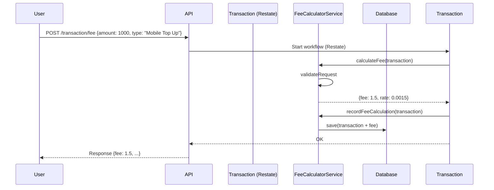

# 📦 Cashi Fee Service

This project is a solution to the Cashi Technology Challenge. It implements a RESTful API for a fees workflow, now utilizing Restate for workflow orchestration.

## 🚀 Technologies Used
```
- Kotlin
- Spring Boot 3
- Restate.dev (workflow engine)
- REST API (OpenAPI / Swagger)
- JUnit 5, kotest
- Docker
- SLF4J Logging
```

## 📋 Requirements

- JDK 17+
- Docker
- Gradle

## sequenceDiagram



```dtd
Client POST /transaction/fee --> FeesService (HTTP handler)
   └─> ctx.startWorkflow("fees", transactionId, request)
          ├─> FeesWorkflow.run(...)
          │     ├─> ctx.runBlock { calculate fee }
          │     ├─> ctx.runBlock { charge fee   }
          │     └─> ctx.runBlock { record result }
          └─> returns WorkflowResult
```


## 📁 Project Structure

```
fee-service/
├── Dockerfile
├── docker-compose.yml
├── build.gradle.kts
├── README.md
└── src
    ├── main
    │   ├── kotlin
    │   │   └── com
    │   │       └── cashi
    │   │           └── feeservice
    │   │               ├── CashiFeeApiApplication.kt
    │   │               ├── config
    │   │               │   ├── AppConfig.kt
    │   │               ├── controller
    │   │               │   └── TransactionController.kt
    │   │               ├── dto
    │   │               │   ├── TransactionRequest.kt
    │   │               │   └── TransactionResponse.kt
    │   │               ├── entity
    │   │               │   └── TransactionFeeEntity.kt
    │   │               ├── repository
    │   │               │   └── TransactionFeeRepository.kt
    │   │               ├── service
    │   │               │   └── FeeCalculatorService.kt
    │   │               ├── workflow
    │   │               │   └── Transaction.kt
    │   │               └── validator
    │   │                   └── TransactionValidator.kt
    │   └── resources
    │       ├── application.properties
    │       └── log4j2.properties
    └── test
        └── kotlin
            └── com
                └── cashi
                    └── feeservice
                        └── scenario
                            └── FeeServiceBDDTest.kt
                            └── service
                                └── FeeCalculatorServiceTest.kt
                            └── scenario
                                └── TransactionValidatorTest.kt
                            └── scenario
                                └── TransactionTest.kt
```

## 🔧 Build and Run

```bash
# Install Restate Server & CLI
$ docker run --name restate_dev --rm -p 8080:8080 -p 9070:9070 -p 9071:9071 \
--add-host=host.docker.internal:host-gateway docker.restate.dev/restatedev/restate:1.3

# Build with gradle
$ ./gradlew clean build

# Run locally
$ ./gradlew bootRun

# Register the service
$ curl localhost:9070/deployments --json '{"uri": "http://host.docker.internal:9080"}'

# Send a request to the service
$ curl --location --request POST 'http://127.0.0.1:8080/Transaction/fee' \
--header 'Accept: application/json' \
--header 'Content-Type: application/json' \
--header 'idempotency-key;' \
--data-raw '{
  "transactionId": "txn_001",
  "amount": 1000,
  "asset": "USD",
  "assetType": "FIAT",
  "type": "Mobile Top Up",
  "state": "SETTLED - PENDING FEE",
  "createdAt": "2023-08-30T15:42:17.610059"
}'
```
### 🐳 Docker Compose
```bash
# Run with Docker
$ docker build -t cashi-fee-service .
$ docker-compose up --build
```

## 🔁 API Example

POST /transaction/fee
```json
{
  "transactionId": "txn_001",
  "amount": 1000,
  "asset": "USD",
  "assetType": "FIAT",
  "type": "Mobile Top Up",
  "state": "SETTLED - PENDING FEE",
  "createdAt": "2023-08-30T15:42:17.610059"
}
```

Response:
```json
{
  "transactionId": "txn_001",
  "amount": 1000,
  "asset": "USD",
  "type": "Mobile Top Up",
  "fee": 1.5,
  "rate": 0.0015,
  "description": "Standard fee rate of 0.15%"
}
```

## 🌐 Swagger Docs
```
http://localhost:8080/swagger-ui.html
```

## 🧩 Restate UI
```
http://localhost:9070/ui/overview (if running with Docker Compose)
```

